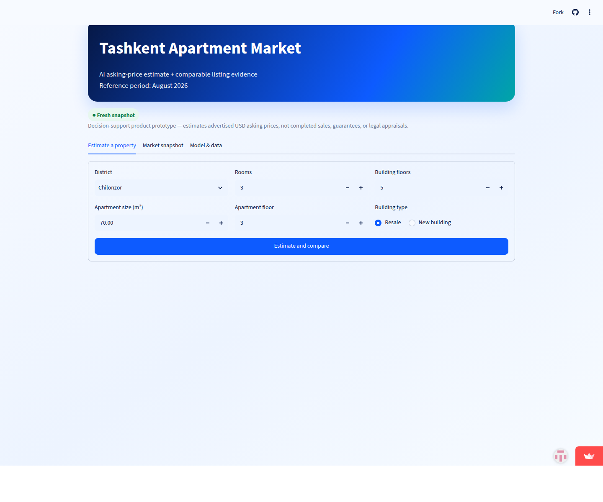

# Tashkent Apartment Listing Price Predictor

[](https://github.com/DilnuraHamdamova/tashkent-apartment-price-predictor/actions/workflows/ci.yml)
[](https://colab.research.google.com/github/DilnuraHamdamova/tashkent-apartment-price-predictor/blob/main/demo.ipynb)

**[View presentation](presentation/README.md)** · **[PowerPoint](presentation/Tashkent_Apartment_Price_Defense.pptx)** · **[PDF](presentation/Tashkent_Apartment_Price_Defense.pdf)**

## Interactive website demo

The repository includes a Streamlit website in `app.py`. Run it locally with:

```bash
python -m pip install -r requirements.txt
streamlit run app.py
```

For a public URL, sign in to [Streamlit Community Cloud](https://share.streamlit.io/), choose
**Create app**, and enter:

- Repository: `DilnuraHamdamova/tashkent-apartment-price-predictor`
- Branch: `main`
- Main file path: `app.py`

The product-style website loads the same committed pipeline used by the API and Colab. It now
shows a dynamic data-reference period, snapshot freshness, an empirical protected-test error band,
price per square metre, comparable-listing aggregates, a district market explorer, and optional
in-session apartment photo preview. Dates are read from the active dataset rather than hard-coded
in the interface. Uploaded photos are not stored and do not affect the current tabular model.

The hero uses an original AI-generated illustrative image, not a source listing photograph. Real
listing galleries require image URLs and display rights from an approved provider API.



Portfolio companion: [Evidence RAG Assistant](https://github.com/DilnuraHamdamova/evidence-rag-assistant), a citation-first LLM/RAG project with offline retrieval, evaluation, FastAPI, and Docker.

## FastAPI and Docker

The same model is available through a validated JSON API:

```bash
uvicorn api:app --host 0.0.0.0 --port 8000
```

Open `http://localhost:8000/docs` for interactive OpenAPI documentation. Key routes are
`GET /health`, `GET /model-info`, and `POST /predict`.

Build and run the production-style container:

```bash
docker build -t tashkent-apartment-price-api .
docker run --rm -p 8000:8000 tashkent-apartment-price-api
```

Checked request:

```bash
curl -X POST http://localhost:8000/predict \
  -H "Content-Type: application/json" \
  -d '{"district":"Chilonzor","size_m2":70,"rooms":3,"level":3,"max_levels":5,"is_new_building":false}'
```

The response returns approximately `$97,098 USD`, warnings, the model's dynamic data window,
protected-test p80 reference error, and a disclaimer.

An end-to-end regression product prototype that estimates the advertised USD asking price of a
Tashkent apartment from a versioned market snapshot. The repository includes a reproducible
privacy-minimized snapshot, feature-group-safe evaluation, a saved inference pipeline, validation,
tests, an interactive market website, a JSON API, Docker delivery, and reproducible documentation.

**Selected track:** Individual Project Track
**Student:** Dilnura Hamdamova

## Problem and scope

Buyers, sellers, agents, and market analysts need a quick reference estimate when comparing
current Tashkent apartment advertisements. This is supervised regression:

- **Input:** district, size (m²), rooms, apartment floor, building floors, new-build/resale.
- **Output:** estimated **2026 advertised asking price in USD**.
- **Primary metric:** MAE, because dollar error is directly understandable.
- **Supporting metrics:** RMSE, R², and MAPE.
- **Success criterion:** reduce baseline test MAE by at least 30%, reach test R² ≥ 0.60, and
  test MAPE ≤ 25%.
- **Non-goals:** completed sale-price verification, legal appraisal, price guarantee, lending,
  taxation, or autonomous financial decision-making.

## Current 2026 data

The committed `data/apartment_listings_2026.csv` is a privacy-minimized snapshot of public
[HATA Tashkent sale listings](https://hata.uz/en/listings/sale/flats/tashkent), collected in
August 2026. The collector retains factual property fields and source URLs but excludes seller
identity, contacts, descriptions, and images.

The snapshot contains 4,867 unique complete-feature listings. Conservative range checks remove
257 obvious category/currency/unit errors, then 396 exact feature + target duplicates are removed,
leaving 4,214 modeling rows and 3,840 apartment-feature groups. Eleven districts are represented;
Yangihayot is absent. See [data/README.md](data/README.md) and
[reports/data_audit.md](reports/data_audit.md).

The target is an **advertised asking price**, not a verified transaction price. HATA does not
publish an open-data license; source rights remain with HATA and listing authors. Written
redistribution permission is a recommended external confirmation before wider reuse. See
[DATA_SOURCE_NOTICE.md](DATA_SOURCE_NOTICE.md) for the code/data license boundary and safe reuse
options.

## Method

The holdout split is fixed with `random_state=42`. Identical apartment fingerprints—district,
rooms, size, floor, building floors, and building type—are kept in one split. Approximately 80%
of feature groups form the development set and 20% form the protected test set, stratified by
district at group level. Model selection uses five-fold `StratifiedGroupKFold` only on development
data. All encoding/scaling stays inside scikit-learn pipelines.

```text
Public 2026 catalog → privacy-minimized snapshot → schema/range validation
       ↓
exact feature+target deduplication → feature fingerprint groups
       ↓
group-safe development/test split → group-safe five-fold model comparison
       ↓
protected unseen test evaluation → saved Random Forest pipeline
       ↓
validated apartment input → 2026 asking-price estimate + range warnings
```

### Training-only cross-validation

| Experiment | CV MAE | CV RMSE | CV R² |
|---|---:|---:|---:|
| Median baseline | $55,604 | $123,587 | -0.068 |
| Log Ridge | $38,301 | $105,755 | 0.219 |
| **Random Forest (selected)** | **$31,298** | **$80,394** | **0.556** |
| Gradient Boosting | $33,545 | $94,081 | 0.396 |

### Protected unseen test result

| Model | MAE | RMSE | R² | MAPE |
|---|---:|---:|---:|---:|
| Median baseline | $50,900 | $107,189 | -0.058 | 46.39% |
| **Random Forest** | **$27,195** | **$58,887** | **0.681** | **24.58%** |

Random Forest reduces MAE by **46.6%** versus baseline and meets all predefined thresholds. The
largest protected-test miss is a $1,000,000 Shayhontohur new-build listing predicted near $234,461.
Performance is much less reliable for high-end listings: Mirobod test MAE is about $52,143 and
Shayhontohur test MAE about $64,541. Full evidence is in `artifacts/metrics.json` and `reports/`.

## Reproduce locally

Python 3.10+ is required.

```bash
git clone https://github.com/DilnuraHamdamova/tashkent-apartment-price-predictor.git
cd tashkent-apartment-price-predictor
python -m venv .venv
source .venv/bin/activate          # Windows: .venv\Scripts\activate
python -m pip install -r requirements.txt
python -m src.train
```

Run a resale-apartment prediction:

```bash
python -m src.predict \
  --district Chilonzor --size 70 --rooms 3 --level 3 --max-levels 5
```

The checked example returns approximately **$97,098 USD**. Add `--new-building` for a new build;
the checked equivalent returns approximately **$103,647 USD**. Values outside training ranges
or unseen districts produce warnings.

Run quality checks:

```bash
python -m pip install -r requirements-dev.txt
python -m pytest
ruff check src tests scripts
```

## Refresh the current snapshot

The committed snapshot makes evaluation reproducible. A later refresh creates a different dataset
and therefore requires retraining and re-reporting every metric:

```bash
python scripts/collect_current_listings.py apartment
python -m src.train
```

The collector follows the public catalog rather than disallowed API routes, uses a delay, and
checkpoints progress. Reconfirm source terms before each refresh.

### Approved multi-source ingestion

The source-neutral ingestion layer accepts any licensed API/CSV export that follows the documented
schema. Every row must keep its source provenance. To merge multiple approved exports and retain
the latest observation for each source listing:

```bash
python scripts/build_training_dataset.py partner_a.csv partner_b.csv \
  --output data/apartment_listings_current.csv
python -m src.train --data data/apartment_listings_current.csv
```

For a single legacy file without a `source` column, add an explicit source name:

```bash
python scripts/build_training_dataset.py export.csv --source approved-partner \
  --output data/apartment_listings_current.csv
```

This makes the product ready for multiple dates and approved providers, but it does not grant
permission to scrape or redistribute any provider's content. Production automation requires a
written data agreement or official API, scheduled collection, data-quality alerts, retraining,
time-based evaluation, artifact versioning, and rollback.

## Colab demo

Open the Colab badge and choose **Runtime → Run all**. The notebook clones the repository when
needed, installs dependencies, loads the committed 2026 pipeline, predicts one resale and one
new-build example, and demonstrates invalid-floor validation without hidden notebook state.

## Limitations and responsible use

- The committed model learns from the displayed snapshot window; it is not permanently live until
  an approved recurring feed and monitored retraining workflow are connected.
- Asking price may differ materially from completed transaction price.
- User-entered listings can be stale, inaccurate, duplicated, or miscategorized.
- Same-feature grouping reduces leakage but cannot identify every relisted physical apartment.
- Exact address, condition, renovation, construction year, legal status, and amenities are absent.
- District slices vary sharply; negative R² in some districts means local reliability is weak.
- Yangihayot has no retained modeling rows and is out of distribution.
- Geographic price patterns may reproduce historical and current location inequality.
- Predictions require human review and recent comparable listings. Do not use this educational
  model for lending, taxation, legal appraisal, or high-stakes financial decisions.
