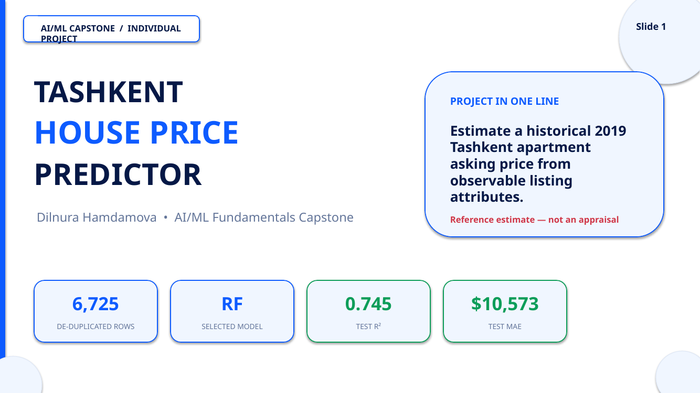
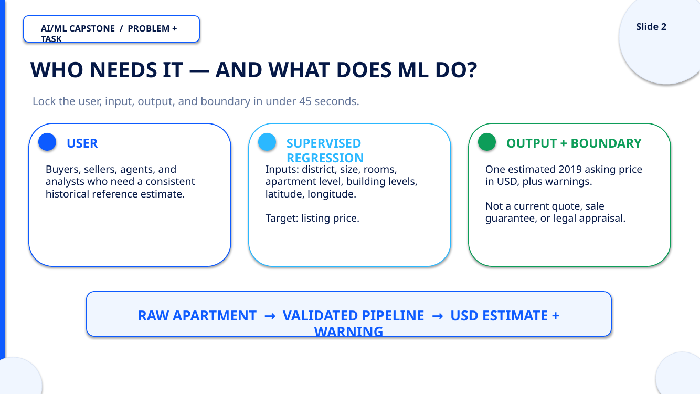
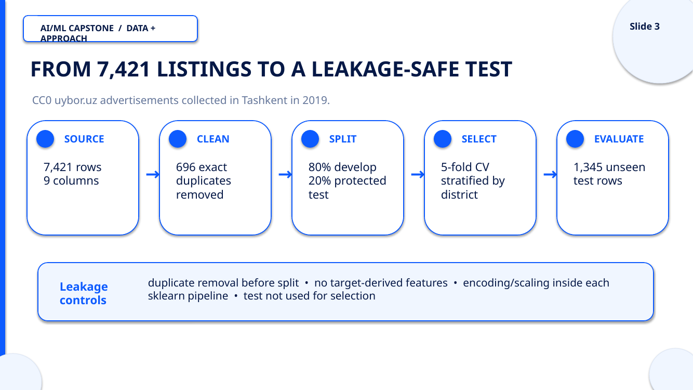
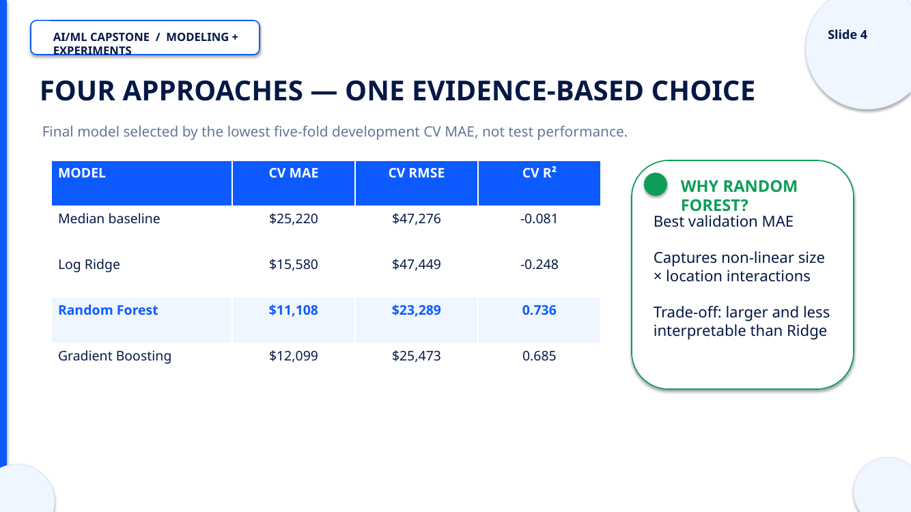
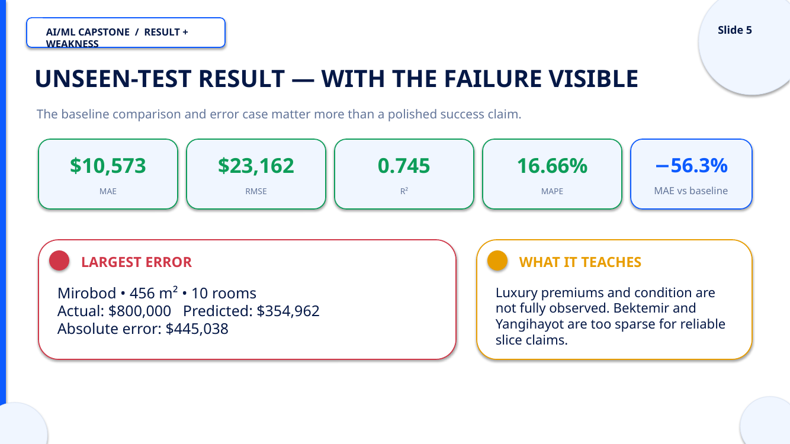
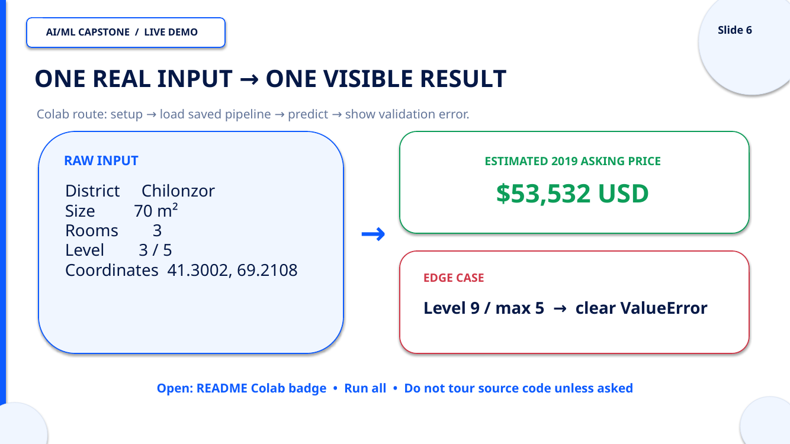
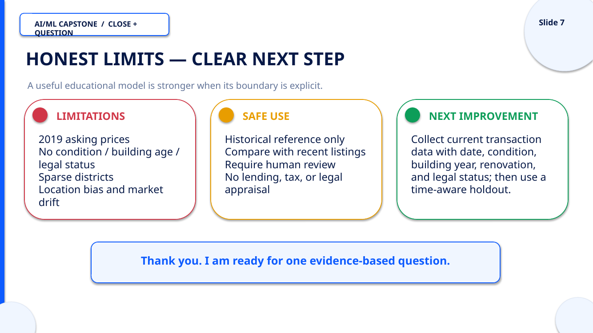
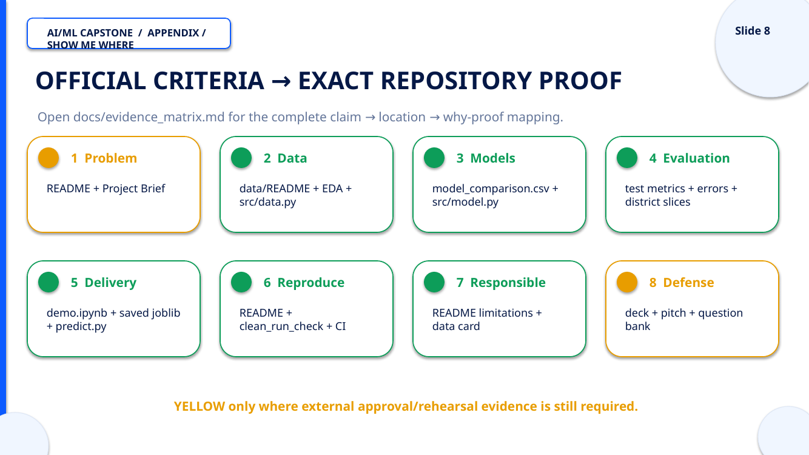
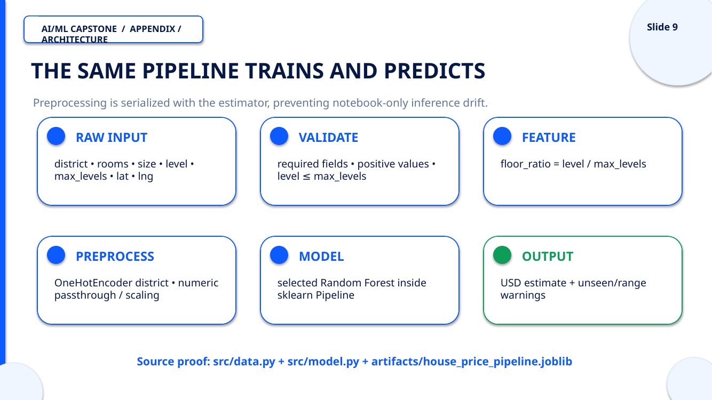
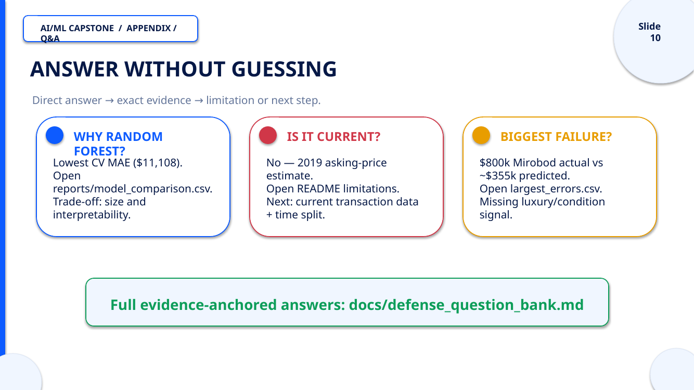

# Defense presentation

## Open or download

- **[View the presentation as PDF](Tashkent_House_Price_Defense.pdf)**
- **[Download the editable PowerPoint](https://github.com/DilnuraHamdamova/tashkent-house-price-predictor/raw/refs/heads/main/presentation/Tashkent_House_Price_Defense.pptx)**
- **[Download the PDF](https://github.com/DilnuraHamdamova/tashkent-house-price-predictor/raw/refs/heads/main/presentation/Tashkent_House_Price_Defense.pdf)**

GitHub does not preview `.pptx` files directly. The PDF and the slide images below make the same presentation viewable in a browser. Slides 1–7 follow the five-minute route in [`docs/defense_pitch_outline.md`](../docs/defense_pitch_outline.md). Slides 8–10 are appendix evidence/architecture/Q&A slides.

## Slide preview

[](preview/slide-01.png)

[](preview/slide-02.png)

[](preview/slide-03.png)

[](preview/slide-04.png)

[](preview/slide-05.png)

[](preview/slide-06.png)

[](preview/slide-07.png)

[](preview/slide-08.png)

[](preview/slide-09.png)

[](preview/slide-10.png)

## Regenerate

Regenerate the PPTX after installing development dependencies:

```bash
python scripts/build_presentation.py
```

The deck uses only repository-verified metrics. Rehearse with a timer and do not read every slide word-for-word.
